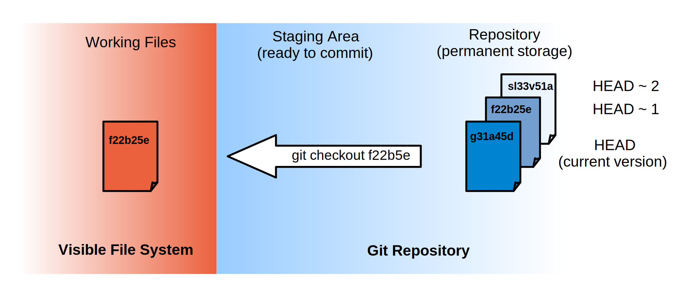

> ## Learning Objectives {.objectives}
>
> *   Identify and use Git revision numbers.
> *   Compare files with old versions of themselves.
> *   Restore old versions of files.

**(SLIDE 17 - Git diff #2)**

###Relative History###

If we want to see what we changed when,
we use `git diff` again,
but refer to old versions
using the notation `HEAD~1`, `HEAD~2`, and so on.

**HEAD** is the most recent end of the chain of revisions.

we can refer to previous revisions using the `~` notation,
so `HEAD~1` (pronounced "head minus one")
means "the previous revision",
while `HEAD~123` goes back 123 revisions from where we are now.

~~~ {.bash}
$ git diff HEAD~1 mars.txt
~~~
~~~ {.output}
diff --git a/mars.txt b/mars.txt
index 315bf3a..b36abfd 100644
--- a/mars.txt
+++ b/mars.txt
@@ -1,2 +1,3 @@
 Cold and dry, but everything is my favorite color
 The two moons may be a problem for Wolfman
+But the Mummy will appreciate the lack of humidity
~~~
So we see the difference between the file as it is now, and as it was **before the last commit**

~~~ {.bash}
$ git diff HEAD~2 mars.txt
~~~
~~~ {.output}
diff --git a/mars.txt b/mars.txt
index df0654a..b36abfd 100644
--- a/mars.txt
+++ b/mars.txt
@@ -1 +1,3 @@
 Cold and dry, but everything is my favorite color
+The two moons may be a problem for Wolfman
+But the Mummy will appreciate the lack of humidity
~~~
And here we see the state before the last **two** commits, HEAD minus2 

###Absolute History###

We can also refer to revisions using
those long strings of digits and letters
that `git log` displays.

These are unique IDs for the changes,
and "unique" really does mean unique:
every change to any set of files on any machine
has a unique 40-character identifier. (A SHA-1 hash of the new, post-commit state of the repository).

Our first commit was given the ID: **(bottom ID from git log)**

f22b25e3233b4645dabd0d81e651fe074bd8e73b,
so let's try this:

~~~ {.bash}
$ git diff f22b25e3233b4645dabd0d81e651fe074bd8e73b mars.txt
~~~
~~~ {.output}
diff --git a/mars.txt b/mars.txt
index df0654a..b36abfd 100644
--- a/mars.txt
+++ b/mars.txt
@@ -1 +1,3 @@
 Cold and dry, but everything is my favorite color
+The two moons may be a problem for Wolfman
+But the Mummy will appreciate the lack of humidity
~~~
So that's all the changes since our first commit.
That's the right answer,but typing random 40-character strings is annoying,
so Git lets us use just the first **seven**:

~~~ {.bash}
$ git diff f22b25e mars.txt
~~~
~~~ {.output}
diff --git a/mars.txt b/mars.txt
index df0654a..b36abfd 100644
--- a/mars.txt
+++ b/mars.txt
@@ -1 +1,3 @@
 Cold and dry, but everything is my favorite color
+The two moons may be a problem for Wolfman
+But the Mummy will appreciate the lack of humidity
~~~

**(SLIDE 18 - Restoring Files)**
###Restoring Files###

All right:
we can save changes to files and see what we've changed&mdash;how
can we restore older versions of things?

Let's suppose we accidentally overwrite our file:

~~~ {.bash}
$ nano mars.txt
$ cat mars.txt
~~~
~~~ {.output}
We will need to manufacture our own oxygen
~~~

**Whoops!**

`git status` now tells us that the file has been changed,
but those changes haven't been staged:

~~~ {.bash}
$ git status
~~~
~~~ {.output}
# On branch master
# Changes not staged for commit:
#   (use "git add <file>..." to update what will be committed)
#   (use "git checkout -- <file>..." to discard changes in working directory)
#
#	modified:   mars.txt
#
no changes added to commit (use "git add" and/or "git commit -a")
~~~

Following the helpful hint in that output, we can put things back the way they were
by using `git checkout`:

~~~ {.bash}
$ git checkout HEAD mars.txt
$ cat mars.txt
~~~
~~~ {.output}
Cold and dry, but everything is my favorite color
The two moons may be a problem for Wolfman
But the Mummy will appreciate the lack of humidity
~~~

As you might guess from its name,
`git checkout` checks out (i.e., restores) an old version of a file.

In this case,
we're telling Git that we want to recover the version of the file recorded in `HEAD`,
which is the last saved revision.

If we want to go back even further,
we can use a revision identifier instead:

~~~ {.bash}
$ git checkout <last but one rev> mars.txt
~~~

**(SLIDE 19 - Restoration)**

The fact that files can be reverted one by one
tends to change the way people organize their work.

If everything is in one large document,
it's hard (but not impossible) to undo changes to the introduction
without also undoing changes made later to the conclusion.

If the introduction and conclusion are stored in **separate files**,
on the other hand, moving backward and forward in time becomes much easier.

###IF TIME###

[Next - Ignoring Things](05-ignore.html) 
