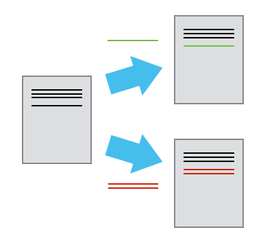

> ## Learning Objectives {.objectives}
>
> *   Understand when version control is useful and how it works

**(FULL SCREEN SLIDE 1 - Version Control with Git)** 

Intro

**(FULL SCREEN SLIDE 2 - What is Version Control?)** 

## What is Version Control ##

Version control tools, also known as **revision control** or **source control** tools, track **changes** to files.  
At the simplest level, you get a better backup tool.  Avoiding this all to common scenario:

### 1. A Better Backup ###

**(FULL SCREEN SLIDE 3  - A Better Backup)** 

We've all been in this situation before - it seems ridiculous to have multiple nearly-identical versions of the same document. Some word processors let us deal with this a little better, like Microsoft Word ("Track Changes") or Google Docs version history.

BUT research isn't just Words docs.  With **Version Control**, at any point in the future, you can retrieve the correct versions of your documents, scripts or code.  So, for example, a year after publication, you can get hold of the precise combination of scripts and data that you used to assemble a paper.  

Version control makes **reproducibility** simpler. If you're not using version control can you honestly say that your research is reproducible?

**(FULL SCREEN SLIDE 4 - Teamwork)**

### 2. A collaboration tool ###

As well as maintaining a revison history, Version Control tools also help multiple authors collaborate on the same file.
VC is what professional software developers use to work in large teams and to keep track of what they've done.  They know who has changed what and when.  And who to blame when things break!

Every large software development project relies on VC, and most programmers use it for their small jobs as well.

VC isn't just for software: papers, small data sets, and anything that changes over time, or needs to be shared can, and probably should be stored in a version control system.

It's worth noting that although most version control system can deal with any file type, 
because they tracks incremental change, many features, like diffs and merges work only with human readable text, not binary files lke images, or Word docs.

We'll look at both the backup and collaboration scenarios, but first it's useful to understand what going on under the hood.

### 3. How do Version Control Tools Work? ###

**(FULL SCREEN SLIDE 5 - Changes are tracked sequentially)** 

Version control systems start with the base version of the file that you save and then record just the changes you made at each step on the way. You can think of it as a tape: if you rewind the tape and start at the base document, then you can play back each change and end up with your latest version.

Once you think of changes as separate from the document itself, you can then think about "playing back" different sets of changes onto the base document and getting different versions of the document. For example, two users can make independent sets of changes based on the same document.

**(FULL SCREEN SLIDE 6 - Different versions can be saved)**

**(FULL SCREEN SLIDE 7 - Multiple versions can be merged)**

If there aren't conflicts, you can even try to play two sets of changes onto the same base document.  A process call **merging**.

## 3. Version Control Alternatives ##

**(FULL SCREEN SLIDE 8 - Version Control Alternatives)**

These are the most popular current Version Control systems.  

**Subversion** has been around since about 2000, it was developed to replace the venerable **Concurrent Versioning System (CVS)** It introduced such revolutionary concepts as the ability to move and rename files whilst retaining their version history.

Both **Mercurial** and **Git** arose from the need to find a new Version Control System for the Linux Kernel, after BitKeeper became non-free in 2005. 

Whereas with Subversion a single master copy of the repository (the files under version control) exists - the only place where all revision history is kept,  **Mercurial** and **Git** are newer and work a little differently - they are **Distributed** Version control systems - each developers copy of the codebase is a complete repository.  You can use Git without a network connection and there's no single point of failuire.

**Git** was written by Linux Torvalds himself, to scratch his own itch, so if you think it's idiosyncractic in places, you know who to blame.

Git has found wider prominence partly through the rise of GitHub - a web based Git repsoitory hosting service.  GitHub also provide bells and whistles like bug tracking, task management and other tools for managing software projects.

You don't need to use GitHub to employ Git, but we will use today to demonstrate the use of remote repositories.

## Topics

0.  [Introduction](index.html)
1.  [A Better Backup / Setting Up Git](01-setup.html)
2.  [Creating a Repository](02-create.html)
3.  [Tracking Changes](03-changes.html)
4.  [Exploring History](04-history.html)
5.  [Ignoring Things](05-ignore.html)
6.  [Collaborating](06-collab.html)
7.  [Conflicts](07-conflict.html)

## Other Resources

* [Overview](version-control-with-git-slides.odp)
* [Glossary Reference](reference.html)

[Next - A Better Backup / Setting Up Git](01-setup.html)
