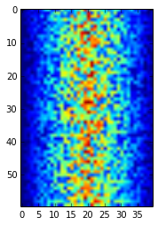
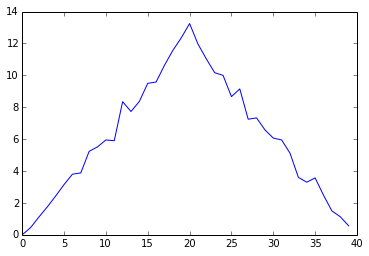
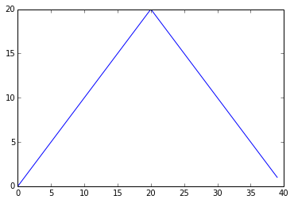
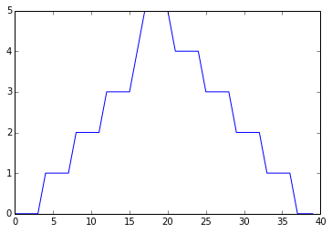

> ## Learning Objectives {.objectives}
>
> *   Plotting data using matplotlib library

The mathematician Richard Hamming once said,
"The purpose of computing is insight, not numbers,"
and the best way to develop insight is often to visualize data.
Visualization deserves an entire lecture (or course) of its own,
but we can explore a few features of Python's `matplotlib` here.
While there is no "official" plotting library,
this package is the de facto standard.
First,
we will import the `pyplot` module from `matplotlib`
and use two of its functions to create and display a heat map of our data:

~~~ {.python}
from matplotlib import pyplot
image  = pyplot.imshow(data)
pyplot.show(image)
~~~

Blue regions in this heat map are low values, while red shows high values.
As we can see,
inflammation rises and falls over a 40-day period.
Let's take a look at the average inflammation over time:

~~~ {.python}
ave_inflammation = data.mean(axis=0)
ave_plot = pyplot.plot(ave_inflammation)
pyplot.show(ave_plot)
~~~

Here,
we have put the average per day across all patients in the variable `ave_inflammation`,
then asked `pyplot` to create and display a line graph of those values.
The result is roughly a linear rise and fall,
which is suspicious:
based on other studies,
we expect a sharper rise and slower fall.
Let's have a look at two other statistics:

~~~ {.python}
max_plot = pyplot.plot(data.max(axis=0))
pyplot.show(max_plot)
~~~

~~~ {.python}
min_plot = pyplot.plot(data.min(axis=0))
pyplot.show(min_plot)
~~~

The maximum value rises and falls perfectly smoothly,
while the minimum seems to be a step function.
Neither result seems particularly likely,
so either there's a mistake in our calculations
or something is wrong with our data.

It's very common to create an [alias](../../reference.html#alias) for a library when importing it
in order to reduce the amount of typing we have to do.
Here are our three plots side by side using aliases for `numpy` and `pyplot`:

~~~ {.python}
import numpy as np
from matplotlib import pyplot as plt

data = np.loadtxt(fname='data/inflammation-01.csv', delimiter=',')

fig = plt.figure(figsize=(10.0, 3.0))

axes1 = fig.add_subplot(1, 3, 1)
axes2 = fig.add_subplot(1, 3, 2)
axes3 = fig.add_subplot(1, 3, 3)

axes1.set_ylabel('average')
axes1.plot(data.mean(axis=0))

axes2.set_ylabel('max')
axes2.plot(data.max(axis=0))

axes3.set_ylabel('min')
axes3.plot(data.min(axis=0))

fig.tight_layout()

plt.show(fig)
~~~

The call to `loadtxt` reads our data,
and the rest of the program tells the plotting library
how large we want the figure to be,
that we're creating three sub-plots,
what to draw for each one,
and that we want a tight layout.
(Perversely,
if we leave out that call to `fig.tight_layout()`,
the graphs will actually be squeezed together more closely.)

> ## Make your own plot {.challenge}
>
> Create a plot showing the standard deviation of the inflammation data for each day across all patients.

> ## Moving plots around {.challenge}
>
> Modify the program to display the three plots on top of one another instead of side by side.

