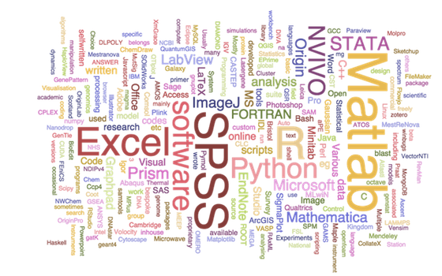

## Why Python?

- It's free, well-documented, and runs almost everywhere
- Large (and growing) user base among researchers and scientists
- Simple, readable, flexible, powerful language and easier for beginners to grasp 
- Goal is to teach basic programming concepts that can be applied to other programming languages

## Cont..

- Part of the winning formula for productivity, software quality, and maintainability at many institutions and companies across the world
    + Largely being used across various application domains:
         + Scientific (Bioinformatics, Biology, Computational chemistry, Data visualisation, Scientific programming etc..)
         + Engineering
         + Software development
         + Arts, business, education and government sectors

## Cont..

- Used for development on the web and the client 
- Increased productivity:
      + Debugging Python programs is easy: a bad input or bug will show a meaningful error message.
      
## What is Python?	

- Close to pseudocode, easy to read
- Indentation marks block structure - simplifies maintenance and aids collaboration
      
## Why teaching Python?

- Based on Southampton PhD students software usage survey conducted by SSI's Policy researchers:
     

## Python3

- Python is currently transitioning from version 2 to 3
- Teaching will be in 3.4
- Lots of new features of Python3
      + Advanced unpacking
      + Matrix multiplication
      + Chained exceptions
      + Everything is an iterator ...
- New syntax. New interpreter behaviour. Standard library fixes        
     
## Basics: Variables, Objects, types and Data Structures

- Introduction to Python variables
- Creating and assigning values to variables
- Everything in Python is really an object
- Types: Built-in types and type handling
     + Built-in: String, integers, boolean and floating point
     + type(val) returns the type of a variable (also classes)  
     + int(val[,base]) converts to an integer (of base base)
     + float(val): Corresponding to floats
     + str(val): Corresponding to strings (classes allow this automatically)

## Python Control Flow

- Real power of programs come from:
      + Repetition
      + Selection
      
## Control Flow: Repeating actions with loops

-  What a loop does?
-  Writing loops to repeat simple calculations
-  Track changes to a loop variable as the loop runs
-  Track changes to other variables as they are updated by a `for` loop      
      
## Lists in Python

-  Lists as arrays
-  Indexing and Slicing      
   
## Using Python libraries

-  This introduction to Python is built around an end to end scientific example: data analysis
-  What is a library (module) and its usage
-  Reading data from a file
         
## NumPy Arrays

-  NumPy arrays and operations on arrays of data

## NumPy arrays: Indexing and Slicing

-  Ways of selecting individual values and subsets of data
-  One-dimensional arrays are simple; on the surface they act similarly to Python lists.
 
## Indexing in a NumPy 2D array 
       + Indexing elements in a  NumPy array:
             
   
## Data visualisation using libraries

-  Plotting data using `matplotlib` library

## Control Flow: Making choices

-  Write conditional statements including `if`, `elif` and `else` 
-  Evaluate expressions containing `and` and `or`

## Why indentation?

-  Studies show that's what people actually pay attention to
       + Every textbook on C or Java has examples where indentation and bracing don't match
-  Doesn't matter how much indentation you use, but the whole block must be consistent     
-  Python Style Guide (PEP 8) recommends 4 spaces 
-  And no tab characters
  
## Creating Functions

-  Defining a function, the parameters that it takes, return value
-  Test and debug a function
-  Scope of variables
-  Set default values for function parameters
-  Divide programs into small, single-purpose functions

## Command-line Programs

-  Using values of command-line arguments in a program
-  Handling flags and files separately in a command-line program
-  Reading data from standard input in a program 

##  Thank You!